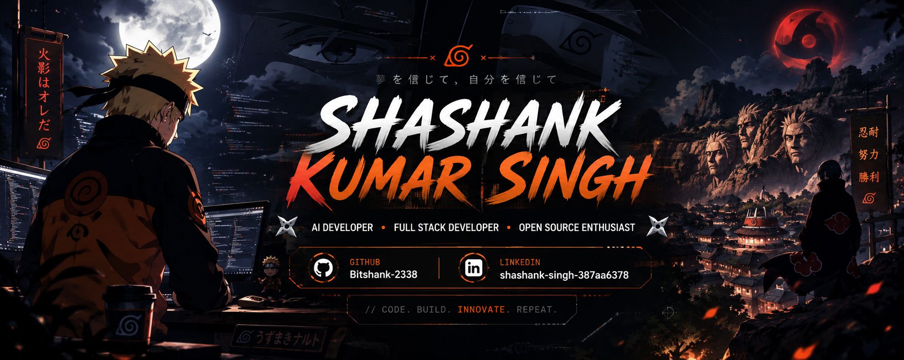

<div align="center">
  
</div>

<div align="center">
  <a href="mailto:iamshashankthedev@gmail.com"></a>
  <a href="https://bitshank-2338.github.io/portfolio/"></a>
  <a href="https://clicky.foo/links"></a>
  <a href="https://clicky.foo"></a>
  <a href="https://linkedin.com/in/shashank-singh"></a>
</div>

<br />

<p align="center">
  
</p>

<p align="center">
  <sub><b>README experience mode:</b> GitHub-native cinematic UI using animated SVGs, live stat surfaces, command panels, and premium developer storytelling.</sub>
</p>

---

## SYSTEM BOOT

```txt
> init shashank-os --mode cinematic --year 2035
[OK] offline-vlm-core ............ armed
[OK] local-agent-runtime ......... private
[OK] cyberpunk-ui-layer .......... glowing
[OK] portfolio-site .............. https://bitshank-2338.github.io/portfolio/
[OK] product-radar ............... clicky.foo detected
[OK] contact-channel ............. iamshashankthedev@gmail.com

mission: build AI systems that are private, fast, useful, and beautifully engineered.
```

## CINEMATIC IDENTITY

<table>
  <tr>
    <td width="33%">
      <h3 align="center">AI Systems</h3>
      <p align="center">Offline agents, VLM workflows, local LLM orchestration, RAG systems, and tool-calling pipelines that run close to the user.</p>
    </td>
    <td width="33%">
      <h3 align="center">Future Interfaces</h3>
      <p align="center">Cyberpunk UI, cinematic motion thinking, command surfaces, smooth storytelling, and clean premium interaction design.</p>
    </td>
    <td width="33%">
      <h3 align="center">Real Products</h3>
      <p align="center">Production-minded builds with practical constraints: latency, privacy, reliability, mobile responsiveness, and useful outcomes.</p>
    </td>
  </tr>
</table>

---

## FEATURED PROJECT / PRODUCT

<table>
  <tr>
    <td width="62%">
      <h3><a href="https://clicky.foo">clicky.foo</a></h3>
      <p><b>Important:</b> clicky.foo is a featured project/product, not my portfolio website.</p>
      <p>It is the launch surface I want visitors to explore first: sharp, simple, product-led, and connected to the wider ecosystem of my work.</p>
      <p>
        <a href="https://clicky.foo"></a>
        <a href="https://clicky.foo/links"></a>
      </p>
    </td>
    <td width="38%">
      <p align="center">
        
        <br />
        
        <br />
        
      </p>
      <p align="center"><code>project://clicky.foo</code></p>
    </td>
  </tr>
</table>

---

## PROJECT LAUNCH DECK

<table>
  <tr>
    <td width="50%">
      <h3><a href="https://github.com/Bitshank-2338/clicky-windows">Clicky Windows</a></h3>
      <p>Offline AI assistant for Windows using local models, screen understanding, speech I/O, and Python/Electron architecture.</p>
      <p><code>Python</code> <code>Electron</code> <code>Ollama</code> <code>VLM</code> <code>Local-first AI</code></p>
    </td>
    <td width="50%">
      <h3><a href="https://github.com/Bitshank-2338/LUMIS">LUMIS</a></h3>
      <p>Cognitive-bias evaluation engine for LLM outputs and automated decision-making workflows.</p>
      <p><code>Python</code> <code>Evaluation</code> <code>LLM Rigor</code> <code>AI Safety</code></p>
    </td>
  </tr>
  <tr>
    <td width="50%">
      <h3><a href="https://github.com/Bitshank-2338/Stock-Inventory-Manager">Stock Inventory Manager</a></h3>
      <p>Production retail inventory system with database-backed workflows, fast search, and practical operator UX.</p>
      <p><code>Python</code> <code>HTML</code> <code>Database</code> <code>Retail Ops</code></p>
    </td>
    <td width="50%">
      <h3><a href="https://bitshank-2338.github.io/portfolio/">Futuristic Portfolio Site</a></h3>
      <p>Cinematic static portfolio experience with neon UI, terminal storytelling, hover effects, and GitHub Pages deployment.</p>
      <p>
        <a href="https://bitshank-2338.github.io/portfolio/">Live site</a> ·
        <a href="https://github.com/Bitshank-2338/portfolio">Source</a>
      </p>
      <p><code>HTML</code> <code>CSS</code> <code>Motion UI</code> <code>GitHub Pages</code></p>
    </td>
  </tr>
</table>

---

## TECH ORBIT

<p align="center">
  
</p>

<p align="center">
  
  
  
  
  
</p>

---

## COMMAND PALETTE

| Command | Destination |
|---|---|
| `open:portfolio-site` | [bitshank-2338.github.io/portfolio](https://bitshank-2338.github.io/portfolio/) |
| `open:featured-product` | [clicky.foo](https://clicky.foo) |
| `open:links-hub` | [clicky.foo/links](https://clicky.foo/links) |
| `inspect:offline-ai` | [Clicky Windows](https://github.com/Bitshank-2338/clicky-windows) |
| `audit:llm-rigor` | [LUMIS](https://github.com/Bitshank-2338/LUMIS) |
| `ship:inventory-system` | [Stock Inventory Manager](https://github.com/Bitshank-2338/Stock-Inventory-Manager) |
| `contact:email` | [iamshashankthedev@gmail.com](mailto:iamshashankthedev@gmail.com) |

<details>
  <summary><b>3D / motion design blueprint</b></summary>
  <br />

  This profile README is constrained by GitHub, so the cinematic layer is expressed through animated SVGs, cards, collapsible panels, stats surfaces, and interactive links.

  The full web experience direction:

  - React / Next.js application shell
  - Tailwind CSS and shadcn-style components
  - Framer Motion and GSAP for page choreography
  - Three.js / React Three Fiber for holographic objects, neon rings, particles, and depth motion
  - Lenis smooth scroll for premium inertia
  - Reduced-motion support, lazy loading, GPU-friendly transforms, and mobile-first layout
  - Anime-inspired orange/blue energy, speed-line atmosphere, and chakra-like trails without copyrighted characters
</details>

<details>
  <summary><b>Hidden AI orb command</b></summary>
  <br />

  ```txt
  /wake ai-orb
  > scanning repositories...
  > portfolio route online: bitshank-2338.github.io/portfolio
  > highlighting product signal...
  > clicky.foo marked as featured project
  > portfolio mode: cinematic, clean, developer-focused
  ```
</details>

---

## GITHUB TELEMETRY

<p align="center">
  
  
</p>

<p align="center">
  
</p>

<p align="center">
  
</p>

---

## CONTACT SIGNAL

<p align="center">
  <a href="https://bitshank-2338.github.io/portfolio/"></a>
  <a href="mailto:iamshashankthedev@gmail.com"></a>
  <a href="https://clicky.foo/links"></a>
</p>

<p align="center">
  <b>Building future interfaces like an AI engineer from 2035.</b>
</p>

<p align="center">
  
</p>

<div align="center">
  
</div>
